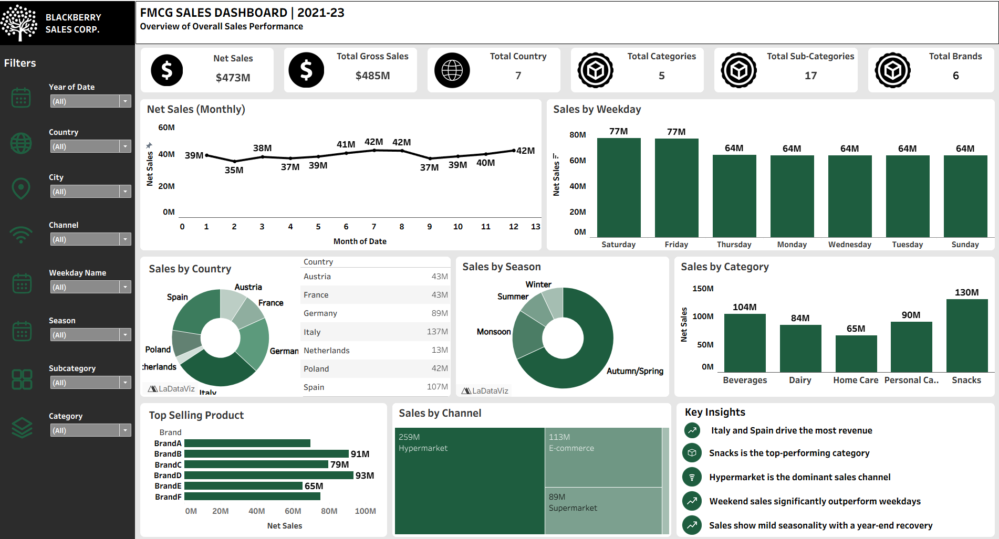

# 🛒 FMCG Global Sales Data Pipeline

> **An automated, end-to-end multi-source data pipeline processing 1.1 Million+ sales transactions across 7 countries with zero manual intervention.**

---

## 📌 Project Overview

Designed and implemented a fully automated, end-to-end big data pipeline to process 1.1 million FMCG sales transactions across 7 countries from multiple sources (AWS, Snowflake, Google Drive), enabling real-time streaming, large-scale cleaning, transformation, and structured storage with zero manual intervention. The pipeline was orchestrated using Apache Airflow to ensure seamless, scheduled execution across all stages, delivering clean, analysis-ready data for interactive Tableau dashboards used in sales insights and reporting. The complete solution was first built and tested on a local big data setup, then deployed and scaled on cloud infrastructure using Databricks for production-grade performance and reliability.

---

## 🎥 Live Demo

### 📹 Project Walkthrough Video
[]([https://dummy-link.com/video.mp4](https://drive.google.com/file/d/19OaRaV3XS-agF6QOx8_tUQaPqznOgSNT/view?usp=drive_link))

> Replace `video-thumbnail.png` with a screenshot of your video (with a play button overlay) and `video.mp4` with your actual hosted demo file or YouTube link.

---

### 🖼️ Tableau Dashboard Preview


---

### 🌐 Tableau Public Link
View Interactive Dashboard: [https://dummy-link.com/tableau-public](https://dummy-link.com/tableau-public)

---

## 🚀 Key Features

* **⚡ Real-Time & Batch Streaming:** Seamless ingestion of 1.1M+ sales records across 7 international markets.
* **🌐 Multi-Source Integration:** Combines raw store, product, and sales data from **AWS**, **Snowflake**, and **Google Drive**.
* **📊 Large-Scale Distributed Processing:** PySpark transformations running over HDFS Parquet storage for high performance.
* **🤖 Fully Automated Orchestration:** End-to-end pipeline management and monitoring using **Apache Airflow**.
* **☁️ Cloud-Scale Deployment:** Pipeline built and tested on a local big data setup, then deployed and scaled in production on **Databricks** for enterprise-grade performance.
* **📈 Interactive Dashboards:** Final analytical datasets surfaced via **Tableau** for business consumption.

---

## 🛠️ Tech Stack & Architecture

| Layer | Technology | Usage / Function |
| :--- | :--- | :--- |
| **Ingestion** |  | Real-time & batch streaming of transaction data |
| **Storage** |  | Distributed storage of streamed data in Parquet format |
| **Sources** |    | Multi-source data input feeds |
| **Data Warehouse** |  | Structured cataloging for raw and processed datasets |
| **Processing** |  | Large-scale data cleaning & ETL transformations |
| **Orchestration**|  | Pipeline workflow scheduling and DAG management |
| **Cloud Storage** |  | Final staging storage for analytics consumption |
| **Containerization**|  | Local environment setup and service isolation |
| **Cloud Deployment**|  | Production-scale deployment and pipeline execution |
| **Visualization**|  | Interactive executive dashboards |

---

## ⚙️ Data Pipeline Workflow

```text
[ AWS / Snowflake / GDrive ] ──┐
                               ├──► [ Apache Kafka ] ──► [ HDFS (Parquet) ]
[ Sales Transactions (1.1M) ] ──┘                                 │
                                                                 ▼
[ Tableau Analytics ] ◄── [ AWS S3 Cloud ] ◄── [ PySpark ETL ] ◄─┘
         ▲                                            │
         └────────────────── [ Apache Airflow DAGs ] ─┘
```

---

## ✅ Prerequisites

Before setting up the pipeline locally, ensure the following are installed and configured on your system:

* **Docker** (v20.10+) & **Docker Compose** (v2.0+)
* **Git** — to clone the repository
* **Minimum System Requirements:** 8+ GB RAM, 4-core CPU, 20+ GB free disk space (Kafka + HDFS + Hive containers are resource-intensive)
* **Java (JDK 8/11)** — required by Hadoop, Hive & Spark base images
* **Python 3.8+** — for PySpark scripts and Airflow DAGs
* **Cloud Access Credentials:**
  * AWS IAM credentials (Access Key & Secret Key) with S3 read/write permissions
  * Snowflake account credentials (account URL, username, password/token)
  * Google Drive API credentials (OAuth `credentials.json` / service account key)
* **Ports Available:** `9092` (Kafka), `2181` (Zookeeper), `9870`/`9000` (HDFS), `10000` (Hive), `8080` (Airflow Webserver)

---

## 🐳 Setup & Installation (via Docker)

The entire pipeline stack — Kafka, Zookeeper, HDFS, Hive, PySpark, and Airflow — is containerized for a one-command local setup.

**1. Clone the repository**
```bash
git clone https://github.com/yaggeshsawant/FMCG-Global-Sales-Data-Pipeline.git
cd fmcg-global-sales-pipeline
```

**2. Configure environment variables**
Create a `.env` file in the project root with your credentials:
```env
AWS_ACCESS_KEY_ID=your_aws_access_key
AWS_SECRET_ACCESS_KEY=your_aws_secret_key
AWS_REGION=your_aws_region
SNOWFLAKE_ACCOUNT=your_snowflake_account
SNOWFLAKE_USER=your_snowflake_username
SNOWFLAKE_PASSWORD=your_snowflake_password
GDRIVE_CREDENTIALS_PATH=./credentials/gdrive_credentials.json
```

**3. Build and start all services**
```bash
docker-compose up -d --build
```
This spins up the following containers:
* `zookeeper` & `kafka` — streaming broker
* `namenode` & `datanode` — HDFS cluster
* `hive-metastore` & `hive-server` — Hive warehouse
* `spark-master` & `spark-worker` — PySpark processing
* `airflow-webserver` & `airflow-scheduler` — orchestration

**4. Verify services are running**
```bash
docker-compose ps
```

**5. Access the service UIs**
| Service | URL |
| :--- | :--- |
| Airflow Webserver | `http://localhost:8080` |
| HDFS NameNode UI | `http://localhost:9870` |
| Spark Master UI | `http://localhost:8081` |

**6. Trigger the pipeline**
Enable and trigger the DAG from the Airflow UI, or via CLI:
```bash
docker exec -it airflow-webserver airflow dags trigger fmcg_sales_pipeline
```

**7. Stop all services**
```bash
docker-compose down
```

> ⚠️ **Note:** This Docker setup replicates the pipeline for **local testing and development only**. The production version of this pipeline is deployed and scaled on **Databricks** for cloud-grade performance.

---
